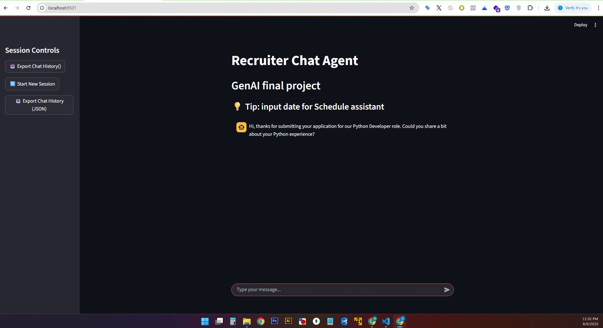
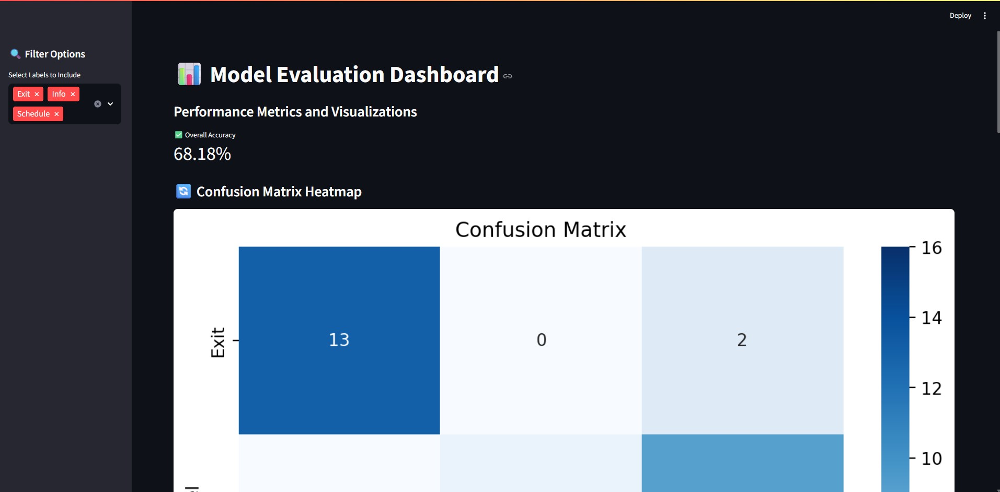

<p align="center">
  
</p>

<h1 align="center">GenAI Recruiter Chatbot</h1>

<p align="center">
  An AI-powered recruiter chatbot 🤖 that evaluates job candidates, schedules interviews,<br>
  and simulates human-like conversations using OpenAI, LangChain, and Streamlit.<br>
  <a href="https://github.com/Sibany/GenAI/issues">Report Bug</a> ·
  <a href="https://github.com/Sibany/GenAI/issues">Request Feature</a>
</p>

---
## 🖼️ streamlit_main_new.py -Main agent Screenshot


## 💡 Overview
This project provides a modular chatbot system with specialized agents designed to streamline the recruitment process.  
It leverages cutting-edge AI technologies to interact with candidates, assess their suitability for roles, and manage interview logistics.

### Key Capabilities
- Ask screening questions to gather initial candidate information.
- Evaluate qualifications by comparing resumes against job descriptions.
- Schedule interviews by checking/booking available time slots in a database.
- Politely and professionally exit conversations when appropriate.

### Technologies Used
- **Python**: Core programming language.  
- **Streamlit**: Interactive UI.  
- **LangChain**: AI agent orchestration.  
- **OpenAI API**: LLM capabilities (ChatOpenAI, OpenAIEmbeddings).  
- **Microsoft SQL Server**: Interview scheduling storage.  
- **ChromaDB**: Vector store for semantic search.  

---

## 🚀 Features
- **Candidate Profiling:** The AI can analyze a resume (PDF) and a job description to extract key information and determine the candidate's suitability for the role.
- **Q&A Functionality:** Ask questions to the AI about the candidate's experience, skills, and qualifications.
- **Interview Scheduling:** The agent can interact with an SQL database to check for available time slots and schedule interviews.
- **ChromaDB Integration:** Uses ChromaDB as a vector store to perform semantic searches on documents (resume and job description).
- **Tool-Based Agent:** The core of the application is a LangChain agent that uses a variety of custom tools to perform its tasks, including:
    - An `module_2` for providing information about the candidate.
    - A `module_schedule` for managing interview appointments.
    - An `module_exit` to gracefully end the conversation.
- **Model Evaluation Dashboard:** A dedicated Streamlit dashboard to evaluate the performance of the model using metrics like overall accuracy and a confusion matrix heatmap.

---
## 🖼️ streamlit_model_dashboard.py - Screenshot


## 🚧 Installation

### Prerequisites
- Python **3.10+** (recommended; works with 3.12+).  
- Microsoft SQL Server + ODBC Driver (17 or 18).  
- OpenAI API Key.  

### Setup Steps
```bash
# Clone repository
git clone https://github.com/Sibany/GenAI.git
cd GenAI

# Create virtual environment
python -m venv .venv
# Windows
.\.venv\Scripts\activate
# macOS/Linux
source .venv/bin/activate

# Install dependencies
pip install -r requirements.txt
```

Dependencies include:  
`langchain-community`, `pyodbc`, `sqlalchemy`, `streamlit`, `python-dotenv`, `openai`,  
`langchain`, `tiktoken`, `pypdf`, `chromadb`, `faiss-cpu`, `scikit-learn`, `pandas`.  

---

## 📂 Database Setup
1. Open **SQL Server Management Studio (SSMS)**.  
2. Run **Tech.sql** to create the `Tech` DB and `dbo.Schedule` table.  
3. Add environment variables in a `.env` file:  

```env
OPENAI_API_KEY="your-openai-api-key"

# SQL Server Configuration
# Ensure you have the correct ODBC driver installed for SQL Server.
# Common driver names are 'ODBC Driver 17 for SQL Server' or 'ODBC Driver 18 for SQL Server'.

SERVER="Your Server Name"
DATABASE="Tech"
DRIVER="ODBC Driver 17 for SQL Server"
# Use this for Windows Authentication (recommended)
SQL_TRUSTED="yes"

# If you are using SQL Server Authentication, uncomment and fill in these:
# USERNAME_SQL="your_username"
# PASSWORD="your_password"
```

---

## 💾 Vector Store Setup (ChromaDB)
Generate embeddings and store them in `.chroma_store`:
```bash
python chroma.py
```

---

## 🚀 Run the Applications

### 1. Recruiter Chatbot
```bash
# Activate venv first
streamlit run streamlit_main_new.py
```
Opens at [http://localhost:8501](http://localhost:8501).

### 2. Model Evaluation Dashboard
```bash
streamlit run streamlit_model_dashboard.py
```

---

## 🖼️ Gif image of the module working behind the scene - Screenshots


---

## 📒 Project Structure
```
recruiter-chatbot/
├── .env
├── app_main_new.py
├── chroma.py
├── module_2.py
├── module_exit.py
├── module_schedule.py
├── Python Developer Job Description.pdf
├── qa_tool_comparison.py
├── qa_tool_comparison_results.json
├── requirements.txt
├── sql.py
├── streamlit_main_new.py
├── streamlit_model_dashboard.py
├── Tech.sql
├── test_json.py
├── sms_conversations.json
├── transformed_sms_conversations.json
└── README.md
```

---

## 🧪 Testing & Development
- **convert_test_json.py** → Simulate interactions via JSON.  
- **qa_tool_comparison.py** → Benchmark QA models. Results in `qa_tool_comparison_results.json`.  
- **sms_conversations.json** → Raw data.  
- **transformed_sms_conversations.json** → Processed version for evaluation dashboard.  

---


## 🔹 Future Improvements
- [ ] Show all available interview slots for selected date.  
- [ ] Add reminders/confirmations (email/SMS).  
...
---

## ⚠️ Troubleshooting
### ImportError: `main_agent` not found
- Ensure `app_main_new.py` is in the same folder as `streamlit_main_new.py`.  
- Confirm `def main_agent(...):` exists at the top level.  

### InterfaceError: ODBC driver not found
- Verify `.env` DB settings.  
- Install correct ODBC driver (`17` or `18`).  
- Check `sql.py` connection string format.  

### LangChainDeprecationWarning
- Update imports to `langchain-community` / `langchain-openai`.  
- Run:
```bash
pip install -U langchain-community langchain-openai
```

---

## ✉️ Contact
**Contributors**  
- Shahaf Tobaly — 📧 tobaly.shahaf@gmail.com  
- Nimrod Schweitzer — 📧 snimsss@gmail.com  
- Maroon Sibany — 📧 Sibany85@gmail.com  


